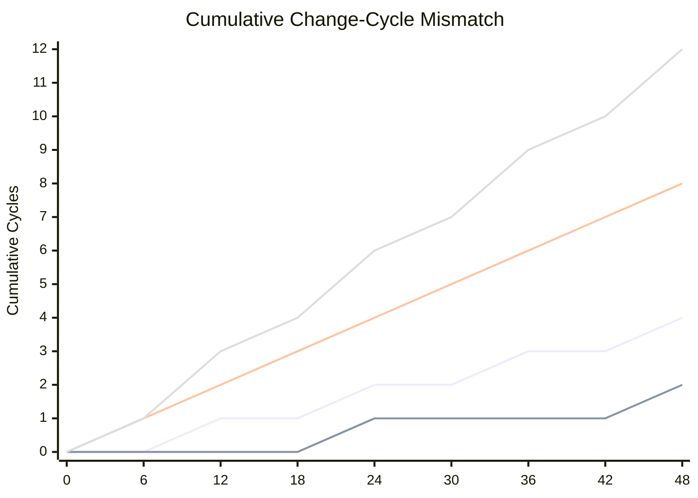

# Curriculum vs Technology Velocity Chart Concept

---

## Purpose

This artifact defines a simple chart concept to show the mismatch between:

* academic curriculum revision cycles
* meaningful technology shift cycles

The goal is not mathematical precision.

The goal is visual clarity:

* academic change happens slowly
* technology change happens repeatedly in the same time window
* the gap compounds over time

---

## Recommended Chart Type

Use a:

* **cumulative cycle count line chart**

This is better than a simple rate chart because it makes compounding lag visible.

---

## Suggested Axes

### X-Axis

* Time in months

Suggested range:

* `0` to `48 months`

This allows two back-to-back academic change cycles to be shown clearly.

---

### Y-Axis

* Cumulative meaningful change cycles completed

This counts how many real update cycles have occurred, not simply elapsed time.

---

## Suggested Series

### Series 1 - Academic Curriculum Revision

Use one or two variants:

* `12-month revision cycle`
* `24-month revision cycle`

This line should rise slowly and stepwise.

Example cumulative points:

| Month | 12-Month Academic Cycle | 24-Month Academic Cycle |
|---|---:|---:|
| 0 | 0 | 0 |
| 6 | 0 | 0 |
| 12 | 1 | 0 |
| 18 | 1 | 0 |
| 24 | 2 | 1 |
| 30 | 2 | 1 |
| 36 | 3 | 1 |
| 42 | 3 | 1 |
| 48 | 4 | 2 |

---

### Series 2 - Technology Shift Cycle

Use one or two variants:

* `6-month meaningful shift cycle`
* `4-month meaningful shift cycle`

These lines rise much faster.

Example cumulative points:

| Month | 6-Month Tech Shift | 4-Month Tech Shift |
|---|---:|---:|
| 0 | 0 | 0 |
| 4 | 0 | 1 |
| 6 | 1 | 1 |
| 8 | 1 | 2 |
| 12 | 2 | 3 |
| 18 | 3 | 4 |
| 24 | 4 | 6 |
| 30 | 5 | 7 |
| 36 | 6 | 9 |
| 42 | 7 | 10 |
| 48 | 8 | 12 |

---

## Core Interpretation

This chart should visually show that:

* after `24 months`
  * academia may have completed `1-2` revision cycles
  * technology may have completed `4-6` meaningful shifts

* after `48 months`
  * academia may have completed `2-4` revision cycles
  * technology may have completed `8-12` meaningful shifts

This is the compounding mismatch.

---

## Important Framing Note

This chart is intentionally conservative.

It only reflects:

* the specific AI / software shifts under discussion

It does **not** attempt to include:

* adjacent automation shifts
* robotics
* autonomous vehicles
* industrial AI adoption
* additional model ecosystem changes
* cloud, hardware, and regulatory changes happening in parallel

That means the real environmental change pressure is likely even larger.

---

## Why "Geometric" Is Better Than Casual "Exponential"

For discussion purposes, this chart does not need to claim strict exponential growth.

A more disciplined framing is:

* the mismatch behaves like a compounding or geometric divergence

because:

* each academic cycle contains multiple technology cycles
* those technology cycles do not wait for academic synchronization
* lag accumulates rather than resetting cleanly

So the key point is:

* the system does not merely fall behind once
* it falls behind repeatedly inside each revision window

---

## Suggested Caption

Possible chart caption:

> **Cumulative Change-Cycle Mismatch:**  
> Over the same 24-48 month window in which academic curriculum revision may complete only 1-4 formal cycles, AI/software domains may experience 4-12 meaningful technology shifts, creating compounding structural lag.

---

## Suggested Whitepaper Line

Use a sentence such as:

> The problem is not simply that technology changes faster than curriculum.  
> The problem is that multiple meaningful technology shifts can occur inside a single academic revision window, causing lag to compound geometrically rather than remain static.

---

## Optional Mermaid Sketch

Legend for the Mermaid sketch:

* `Yellow` = Tech 4-Month Shift Cycle
* `Red` = Tech 6-Month Shift Cycle
* `Blue` = Academic 12-Month Cycle
* `Green` = Academic 24-Month Cycle

This is a conceptual sketch only.

For publication, a cleaner rendered chart may be preferable.
